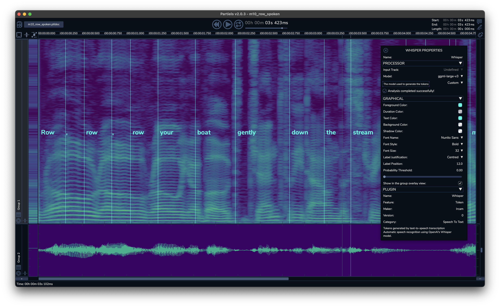

<h1 align="center">Whisper Vamp Plugin Manual</h1>

<i>Version APPVERSION for Windows, Mac & Linux</i> 
<i>Manual by Pierre Guillot</i> 
<a href="www.ircam.fr">www.ircam.fr</a>  

## Table of contents

1. [Introduction](#introduction)
2. [Requirements](#system-requirements)
3. [Installation](#installation)
4. [Models](#models)
5. [Inputs](#inputs)
5. [Credits](#credits)

## Introduction

The Whisper plugin is an implementation of the [Whisper](https://github.com/openai/whisper) speech recognition model developed by [OpenAI](https://openai.com/) as a [Vamp plugin](https://www.vamp-plugins.org/). The Whisper plugin analyses the text in the audio stream and generates markers corresponding to the tokens (words and/or syllables) found. The lightweight ggml-tiny model is embedded in the plugin (so you don’t have to download anything to start experimenting), but it is possible to download and use other models that may be more appropriate to your needs.

The Whisper Vamp Plugin has been designed for use in the free audio analysis application [Partiels](https://forum.ircam.fr/projects/detail/partiels/).

## Requirements

- Windows 10
- MacOS 10.15 (ARM)
- Linux

## Installation

Use the installer for your operating system. The plugin dynamic library (*whisper.dylib* for MacOS, *whisper.dll* for Windows and *whisper.so* for Linux) and the category file (*whisper.cat*) will be installed in your operating system's Vamp plugin installation directory:
- Linux: `~/vamp`
- MacOS: `/Library/Audio/Plug-Ins/Vamp`
- Windows: `C:\Program Files\Vamp`

## Models

By default, the plugin embeds the ggml-tiny model, which requires little space and offers fairly fast calculation but relatively unreliable results.  

It is possible to download other models that are potentially more robust. To do this, you can use the `download-ggml-model.sh/cmd` scripts from Georgi Gerganov's [Whisper.cpp](https://github.com/ggerganov/whisper.cpp) project and provided with the plugin package. Once downloaded, these models must be installed in the repository:
- Linux: `~/.config/Ircam/whispermodels` or `/opt/Ircam/whispermodels`
- MacOS: `~/Library/Application Support/Ircam/whispermodels` or `/Library/Application Support/Ircam/whispermodels`
- Windows: `\Documents and Settings\username\Application Data\Ircam\whispermodels` or `\Documents and Settings\All Users\Application Data\Ircam\whispermodels`

It is possible to use another directory by setting the `WHISPERMODELSPATH` environment variable. 

Once installed in one of the directories, you can select the models in the plugin properties window. 

> ⚠️ Please note that if you delete, modify or add models in these directories, the models will no longer be indexed in the same way, and the plugin may no longer be able to find the selected model. After modification, make sure that the template name corresponds to the one you want.

[Further information](https://github.com/ggerganov/whisper.cpp/blob/master/models/README.md#available-models) on downloading and generating models can be found on Georgi Gerganov's Whisper.cpp project page. 

## Inputs

The plugin lets you define an input marker track to segment the analysis. This feature can be useful in avoiding the biases of certain models, such as the generation or repetition of words not present in the audio stream.

## Credits

- **[Whisper Vamp plugin](https://www.ircam.fr/)** by Pierre Guillot at IRCAM
- **[Whisper.cpp](https://github.com/ggerganov/whisper.cpp)** by Georgi Gerganov
- **[Whisper](https://github.com/openai/whisper)** model by OpenAI
- **[Vamp](www.vamp-plugins.org)** by the Centre for Digital Music, Queen Mary, University of London

